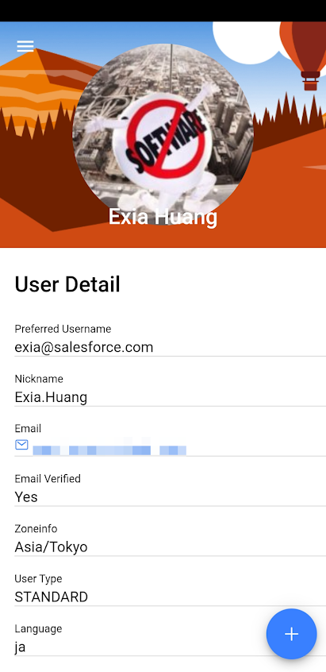

# SF365: Salesforce Mobile client.

[SF365 Google Play Download](https://play.google.com/store/apps/details?id=com.sf365.app)
Run your salesforce in mobile app: faster, easier.
Feature:
- Sobject Manager.
- Run Visualforce app.
- View Report.
- File Manager: Upload with camera.
- Api Limit: View Sfdc api limit.
- Support Apple Map / Goolge Map.
- Support Product/Fullsand/Sandbox/DX scratch org/Developer edition.

[SF365 グループプレイダウンロード](https://play.google.com/store/apps/details?id=com.sf365.app&hl=ja)
携帯電話から、より速く簡単にセールスフォースを管理する。
特徴:

- オブジェクトの管理.
- Visualforce Appの実行.
- レポートをサポート
- ファイル管理: 簡単に写真/ファイルをアップロード.
- システムAPI制限リスト.
- アップルマップ/グーグルマップをサポート.
- 本番/FullSand/Sandbox/Dxスクラッチ/デベロッパー環境をサポート.

[SF365 下载](https://play.google.com/store/apps/details?id=com.sf365.app&hl=ja)
移动端快速，简单管理你的赛富时应用程序。
特点:
- 对象管理器.
- 支持Visualforce.
- 支持报表.
- 文件管理器：拍照/文件上传下载. 轻松分享文件到微信等其他app。
- 随时查看系统API限制.
- 支持Apple地图和Google地图.
- 支持Product/FullSand/Sandbox/Dx scratch/Developer edition环境.

